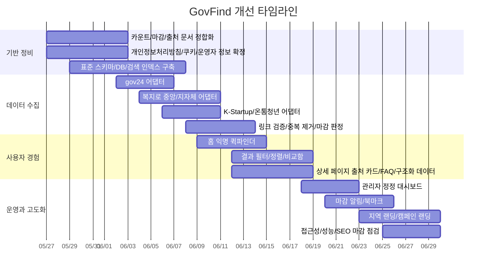

# GovFind 개선 로드맵

GovFind의 실행 순서는 기능 추가보다 데이터 신뢰 회복이 먼저다. 초기 방향성은 좋지만, 카운트 불일치, 미완성 법무 문서, 공개 출처 문서의 구 API 표기 같은 작은 균열이 브랜드 신뢰를 떨어뜨릴 수 있다. 따라서 첫 단계는 데이터, 법무, 문서 정비이고 그 다음에 익명 퀵파인더, 비교함, 저장/알림 같은 UX 강화를 붙인다.

GovFind의 핵심 가치는 광고형 머니 미디어가 아니라 공식 출처 기반 정보 탐색이다. 커뮤니티, 리워드, 포인트, 익명 라운지, 자극적 머니 피드는 초기 범위에서 제외한다.

## 타임라인

## 실행 체크리스트

| 우선순위 | 체크리스트 | 완료 기준 | 현재 상태 |
| --- | --- | --- | --- |
| P0 | 홈/목록/상세 전체 건수 계산을 하나의 인덱스 기준으로 통일 | 어느 화면에서도 총 건수가 서로 다르지 않음 | 1차 구현 완료. `packages/shared`의 공통 count/search 기준 사용 |
| P0 | 정부24·복지 API 최신 엔드포인트 기준으로 출처 페이지 재작성 | 공개 문서에 구 API 명칭이 남아 있지 않음 | 일부 문서화 완료. 공개 출처 페이지 최종 정리는 남음 |
| P0 | 개인정보처리방침, 쿠키, 광고, 문의/정정 정책 확정 | “추후 보완” 문구 제거 | 리빌드 초안 생성. 실제 운영자 정보 확정 필요 |
| P0 | 익명 퀵파인더 구현 | 홈에서 1차 조건 입력 후 결과로 이동 | 1차 구현 완료 |
| P0 | 상세 페이지 출처 카드와 마지막 확인일 추가 | 모든 상세 페이지에 공식 URL, lastCheckedAt, sourceSystem 노출 | 상세 구조 1차 구현. 출처 카드 표현 고도화 필요 |
| P0 | 링크 검증 배치 작업 추가 | 깨진 공식 링크가 운영자 대시보드에 자동 적재 | 미구현. 다음 작업 우선순위 |
| P1 | 저장/북마크 구현 | 계정 또는 이메일 기반으로 정책 저장 가능 | 미구현 |
| P1 | 마감 알림 구현 | 마감 7일/1일 전 알림 설정 가능 | 미구현 |
| P1 | 비교함 구현 | 2~4개 정책을 한 화면에서 비교 | 1차 구현 완료 |
| P1 | 지역 랜딩 자동 생성 | 시도·시군구 기준 URL 체계와 canonical 정리 완료 | 1차 구현 완료. 시군구 확장 필요 |
| P1 | 인기/마감/최근업데이트 허브 고도화 | 갱신 기준과 시각이 함께 표시됨 | 일부 구현. 최근업데이트 허브 필요 |
| P2 | 개인화 추천 | 저장 이력과 관심 조건 기반 추천 카드 제공 | 미구현 |
| P2 | 사전진단 | 참고용 진단과 “법적 효력 없음” 고지 동시 제공 | 미구현 |
| P2 | 공공 마이데이터 연계 검토 | 인증/동의/법무/보안 요건 문서화 완료 | 인터페이스 검토 단계 |
| P2 | PWA 또는 앱 패키징 | 북마크/알림 중심 반복 사용 시나리오 확보 | 미구현 |

## 다음 작업 순서

1. 링크 검증 배치 작업을 만든다.
2. 관리자 대시보드에 broken link, stale policy, duplicate 후보를 실제 데이터로 보여준다.
3. 공개 출처 페이지를 최신 API 명칭과 실제 구현 상태 기준으로 다시 정리한다.
4. 상세 페이지의 출처 카드에 `sourceSystem`, 공식 URL, 마지막 확인일, 원문 확인 상태를 고정 노출한다.
5. 개인정보처리방침의 운영자 정보, 광고/쿠키 범위, 정정 요청 처리 기준을 실제 운영값으로 확정한다.
6. gov24, 복지로, K-Startup, 온통청년 어댑터를 실제 API 응답 기준으로 하나씩 채운다.

## 완료 판정 원칙

- 사용자가 보는 정보는 공식 출처 기준이어야 한다.
- GovFind는 받을 수 있다거나 신청 가능하다고 단정하지 않는다.
- 기능이 실제 구현되지 않았으면 준비 중, 확인 기준, 예정으로 표현한다.
- 검색, 카운트, 카테고리, 상세는 같은 표준 스키마와 같은 인덱스 기준을 사용한다.
- 운영자용 SEO/개발 문서는 사용자용 가이드에 노출하지 않는다.
